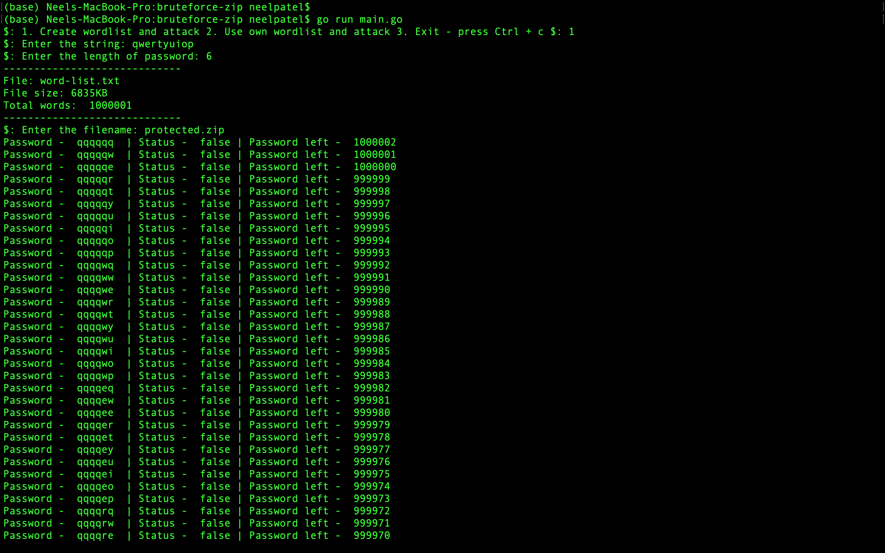
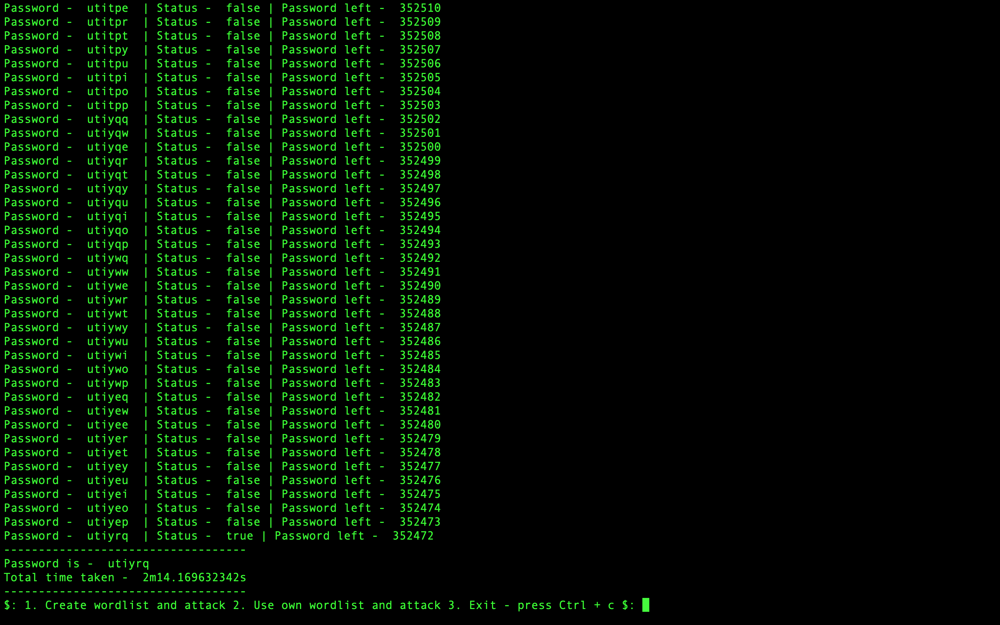

# bruteforce-zip
Crack the password protected zip files and folders using brute-force attack with golang and python. It generates the password list file using length of password.

It requires following two programming language installed on the computer
1. Go
2. Python

To crack the zip file run the main.go file:
```
go run main.go
```


---

